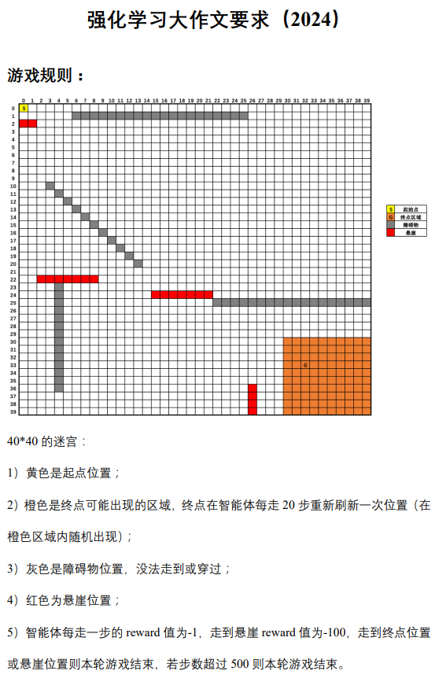
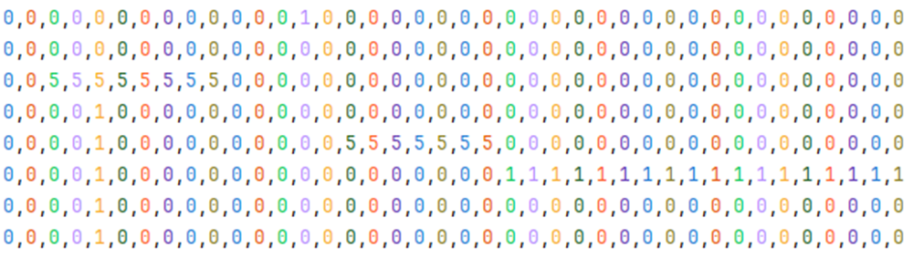
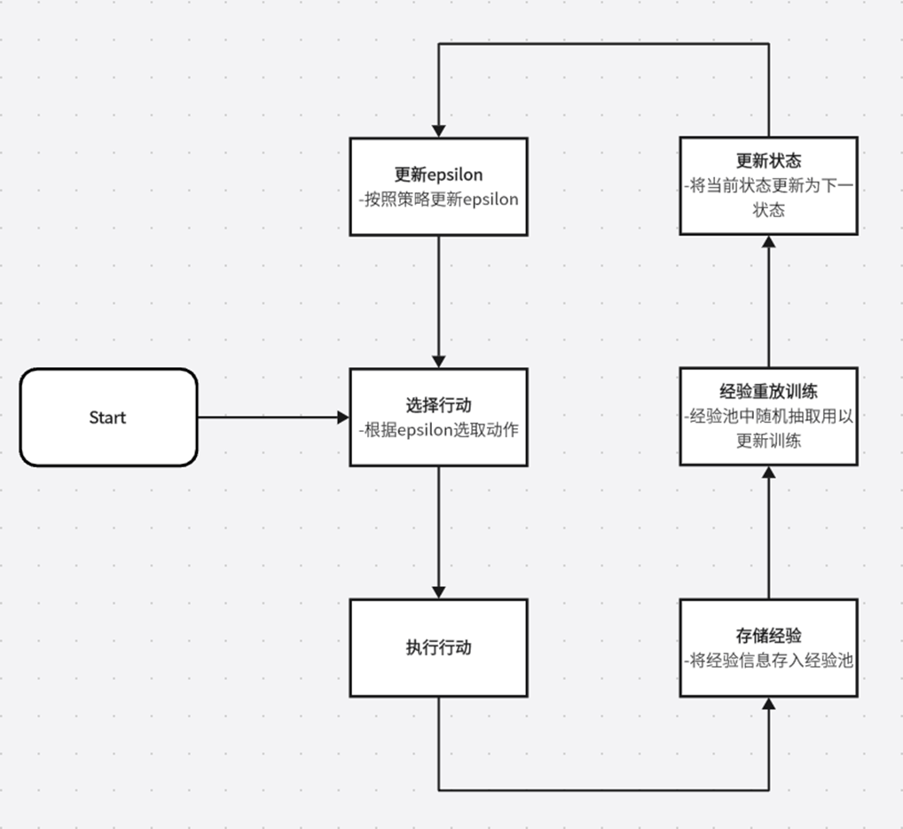
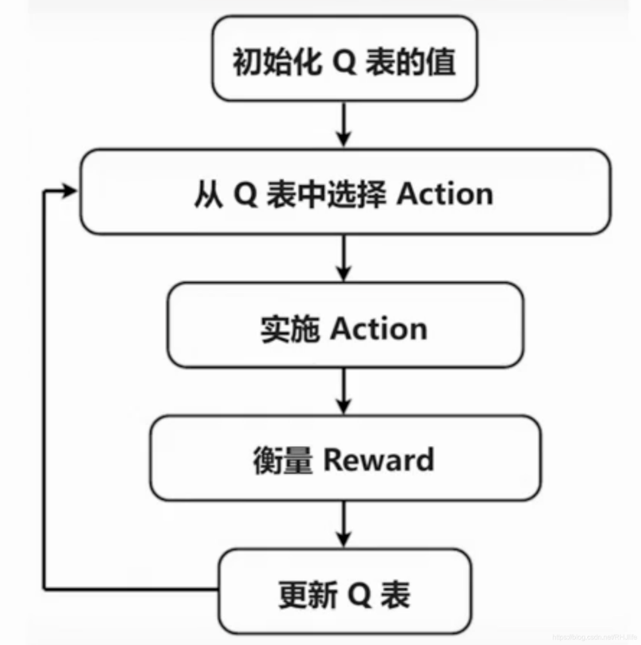
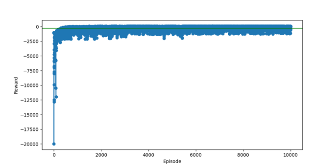
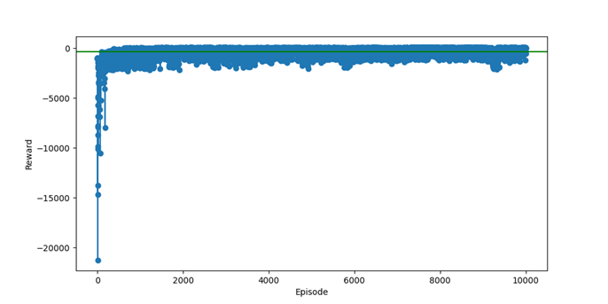
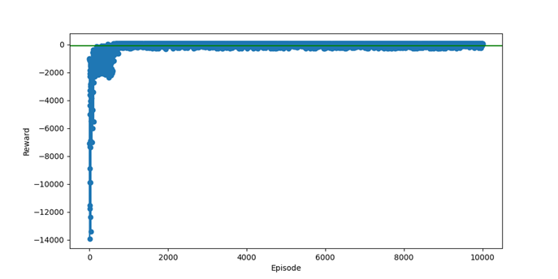

# 任务要求

---
# 具体内容
## 1 解题思路

在强化学习任务中最重要的几个部分是：
- 状态(State)：智能体所处的环境状况。
- 策略(Policy)：智能体在给定状态下执行动作的概率分布，是学习过程的核心。
- 动作(Action)：智能体可以执行的操作或决策。
- 奖励(Reward)：智能体在执行动作后接收的反馈信号。
- 价值(Value)：智能体在给定状态下执行某个动作后期望获得的累积奖励。

因此我们分别从这五个方法具体分析我们本次的任务。

### 1.1 状态（state）
状态就是它当前的位置，由于本任务是一个二维的迷宫环境，因此我选择使用 [CSV 文件](maze_map.csv) 直接存储我的地图。因为，通过使用 CSV 文件中坐标的不同数字，我可以直观的表示不同的障碍物悬崖等信息。

### 1.2 策略(Policy)
策略就是，在给定的状态之下，智能体执行动作的概率分布。

本次任务与其他迷宫任务不同的点在于，迷宫会在一定的范围之内随机移动。
这就意味着，智能体的决策策略并不能像以往一样，单纯的逐步降低探索率，使其专注于抵达终点；而是智能体在开始可以抵达终点之后，我们依然要让其保持一个较高的随机探索率使其得以在终点区域抵达终点的位置。

#### 1.2.1 Epsilon贪心策略
这是一种常用于强化学习中的策略选择方法。
其核心点在于：利用和探索。
- **利用**：以一定的概率选择当前已知的最优动作，即利用已有信息来最大化当前的收益。
- **探索**：以一定的概率随机选择动作，尝试新的动作以发现可能更好的策略。

以这样的方法，智能体可以在不完全了解环境的情况下，通过试探性探索来寻找最优解，并逐步优化决策。

此外，我还进一步的探索了，两种不同的Epsilon衰减策略，比较了一下性能，就本次任务而言，第二种按固定比例衰减的策略是比较合适的：
| Epsilon 衰减策略 | epsilon = epsilon / (iteration + 1) | Epsilon *= 0.995 |
| --- | --- | --- |
| 公式 | 探索率与epsilon成反比，并且随着迭代次数增加而逐渐减少。 | 按固定比例逐步衰减 |
| 优点 | 初始阶段，探索率较高，最终趋近于0 | 探索率下降较为平缓，能够在较长时间内保持一定的探索性。 |
| 缺点 | 探索率下降较快，可能会导致后期探索不足 | 需要自己去具体调整自己的值 |
| 适用的场景 | 环境较为简单、变化不大 | 环境复杂、多变，或者需要持续探索以避免局部最优的情况 |

#### 1.2.2 经验回放策略
这是一种用于改进强化学习算法的技术，特别是在深度强化学习中经常被使用。
其核心点在于：经验存储和经验回放。
- **经验存储**：在每次与环境交互时，智能体将经验存储到经验池中。
- **经验回放**：从经验池中随机抽样一小批经验，并使用这些经验进行训练。

以这种方式，打破了连续经验之间的时间相关性，因为它不依赖于按时间顺序更新策略，而是随机抽样历史经验。并且，每个经验可以被多次使用，这提高了数据的利用效率，通识使训练过程更加平滑和稳定。

如图所示是经验回放策略的流程图：

### 1.3 动作(Action)
动作就是智能体所能做的操作，在本次任务中，由于是二维的迷宫，因此智能体只有“上”“下”“左”“右”这四个动作可选。

### 1.4 奖励(Reward)
奖励就是智能体得到的反馈值，在任何一个强化学习任务之中，设置一个合适的奖励函数都是至关重要的，我在本次任务之中，对于模型超参数的选择与调整次数整体不多，但是对于奖励值得研究还是非常细致的。
本次任务中我使用了以下四种奖励值：
1. **距离奖励值**
2. **危险区域惩罚值**
3. **防止终点区域“守株待兔”现象**
4. **重复路径惩罚值**

#### 1.4.1 距离奖励值
使用了曼哈顿距离，将其与终点区域左上角我们所设置的二级路径点做计算，如果其距离距离减少予与距离的倒数的奖励值，反之则予与负的奖励值。
用这种方式在大迷宫环境之下，可以对于智能体起到一定的引导作用，使其更加倾向于靠近终点区域，提升收敛速度，减少所需的时间。

#### 1.4.2 危险区域惩罚值
经过我们的研究发现，有时候一些模型（如，Dueling DQN）存在着一定的震荡情况，也就是喜欢贴着悬崖前进，这样就会导致如果决策时出现了小概率的随机游走事件，会导致其坠入悬崖；因此，为了防止上述情况的发生，我设计了一个简单的惩罚奖励值，防止智能体靠近悬崖或者墙壁等区域，以此来预防坠崖事件的发生。

#### 1.4.3 防止终点区域“守株待兔”现象
经过我们的观察后发现，智能体有时在抵达终点之后会出现在一定区域内反复横跳的情况，我们推测这种情况的发生是由于，智能体在抵达过终点后，由于终点区域的奖励值过高，探索率过低，导致模型更加倾向于在这个区域之内反复的横跳，并且由于终点是会移动的，会出现终点“撞”到这几个点上造成，这几个点的 reward 越来越高，最终导致模型在这个地方反复移动。
为了避免这种情况的发生，我修改了 reward 的设定，如下：

1. 终点区域的奖励值过高 -> 大大降低终点的奖励值
2. 探索率过低 -> 提升终点区域的随机奖励值
3. 会走重复路径 -> 增加重复路径惩罚

经过上述几种措施之后，我发现整体智能体就会更加倾向于在终点区域内自由探索了。

#### 1.4.4 重复路径惩罚值
这个很好理解，刚刚我们在 1.4.3 中也提到了，这是一个非常有效的解决模型爱走重复路径的情况，我们通过记录走过的路径，走过的掉大分，没走过的上小分，以此鼓励模型走一些没走过的路径。

## 2 具体实现
### 2.1 动作函数
总共四个动作，用 1~4 分别表示：
~~~
def get_next_state(self, action: int) -> None:
    x, y = self.turn_to_position(self.current_state)

    if action == 0:
        x = max(x - 1, 0)
    elif action == 1:
        x = min(x + 1, self.NUM_COLS - 1)
    elif action == 2:
        y = max(y - 1, 0)
    elif action == 3:
        y = min(y + 1, self.NUM_ROWS - 1)

    self.next_state = self.turn_to_state(x, y)
~~~

### 2.2 奖励函数

设置基本的奖励函数索引表与后续需要用的计算曼哈顿距离：
~~~
    # 鼓励在终点的区域之内探索
    random_reward = np.random.uniform(0, 2)

    # reward 索引表
    reward_dir = {
        0: -1,              # 空地
        1: -1000,           # 墙壁时
        2: 15,              # 终点位置
        3: random_reward,   # 终点可能存在的区域
        4: -4,              # 危险区域(贴近墙壁或悬崖的位置)
        5: -1000,           # 悬崖
        6: 4                # 手动引导点
    }

    # 计算曼哈顿距离
    def manhattan_distance(x1, y1, x2, y2):
        return abs(x1 - x2) + abs(y1 - y2)
~~~

完整的奖励函数的设置：
~~~
    def get_reward(self) -> float:
        # 基准奖励
        x, y = self.turn_to_position(self.next_state)
        base_reward = reward_dir.get(self.maze[x][y])

        # 接近奖励
        goal_x, goal_y = self.turn_to_position(self.goal_state)
        distance = manhattan_distance(x, y, goal_x, goal_y)
        # 距离越近则奖励越高
        if distance <= self.distances:
            proximity_reward = 10 / (distance + 1)
        # 否则予与负的奖励
        else:
            proximity_reward = - (5 / (distance + 1))
        self.distances = distance

        # proximity_reward = 10 / (distance + 1)  # 距离越近，奖励越高

        # 重复路径惩罚
        if (x, y) in self.visited_positions:
            repeat_penalty = -5
        else:
            repeat_penalty = 0.3
            self.visited_positions.add((x, y))

        total_reward = base_reward + proximity_reward + repeat_penalty
        return total_reward
~~~

### 2.3 策略函数
#### Epsilon 贪心策略实现
使用探索率与epsilon成反比，并且随着迭代次数增加而逐渐减少的衰减策略：
~~~
    # 选择下一个行动
    def choose_action(self, config: Maze_config, iteration: int) -> int:
        # 使用 epsilon 贪心策略选择动作，其中探索率随迭代次数递减
        exploration_rate = self.epsilon / (iteration + 1)
        if np.random.rand() < exploration_rate:
            action = np.random.randint(config.NUM_ACTIONS)
        else:
            action = np.argmax(self.Q[config.current_state, :] + np.random.randn(1, config.NUM_ACTIONS) * (1. / (iteration + 1)))
        return action
~~~

#### 经验回放策略实现
经验存储实现：
~~~
    # 记忆
    def remember(self, state, action, reward, next_state, done):
        self.memory.append((state, action, reward, next_state, done))
~~~

经验回放实现：
~~~
    # 经验回放
    def replay(self) -> None:
        if len(self.memory) < self.batch_size:
            return

        minibatch = random.sample(self.memory, self.batch_size)
        state_batch = torch.cat([self.turn_to_tensor(state) for state, _, _, _, _ in minibatch])
        next_state_batch = torch.cat([self.turn_to_tensor(next_state) for _, _, _, next_state, _ in minibatch])

        q_values = self.model(state_batch)
        next_q_values = self.target_model(next_state_batch)

        target = q_values.clone()
        for i, (state, action, reward, next_state, done) in enumerate(minibatch):
            # G 了不考虑未来回报
            if done:
                target[i][action] = reward
            # Q 是折扣后的未来奖励
            else:
                target[i][action] = reward + self.gamma * torch.max(next_q_values[i]).item()

            # 计算损失和优化
            loss = self.criterion(q_values, target.detach())
            self.optimizer.zero_grad()
            loss.backward()
            self.optimizer.step()

        # 更新epsilon
        if self.epsilon > self.epsilon_min:
            self.epsilon *= self.epsilon_decay
~~~

### 2.4 其他非算法部分的实现

#### 2.4.1 动态更新迷宫终点
每隔固定步数随机更新迷宫终点：
~~~
    def update_goal(self) -> None:
        goal_x, goal_y = self.turn_to_position(self.goal_state)
        self.maze[goal_x][goal_y] = 3

        next_goal_x, next_goal_y = random.choice(self.positions_of_goal)
        self.maze[next_goal_x][next_goal_y] = 2

        # 更新
        self.goal_state = self.turn_to_state(next_goal_x, next_goal_y)
~~~

#### 2.4.2 可视化
使用 PyGame库进行可视化：
~~~
    # 填某一块的颜色
    def draw_block(self, color: tuple, position: tuple) -> None:
        block = pygame.Surface((self.BLOCK_SIZE, self.BLOCK_SIZE))
        block.fill(color)
        rect = block.get_rect()
        rect.topleft = (position[1] * self.BLOCK_SIZE, position[0] * self.BLOCK_SIZE)

        self.screen.blit(block, rect)

    # 区分颜色然后画图
    def draw_maze(self, config: Maze_config) -> None:
        for i in range(len(config.maze)):
            for j in range(len(config.maze[i])):
                color = color_dir[config.maze[i][j]]
                self.draw_block(color, (i, j))
~~~

#### 2.4.3 绘制 Reward 曲线
使用 matplotlib 库进行奖励值的绘制：
~~~
    # 画图
    def draw_reward(config: Maze_config, rewards: list) -> None:
        episode_numbers = list(range(1, len(rewards) + 1))
        avg_reward = sum(rewards) / len(rewards)

        plt.figure(figsize=(10, 5))
        plt.plot(episode_numbers, rewards, marker='o')  # 绘制折线图，使用圆圈标记每个点
        plt.axhline(y=avg_reward, color='green')  # 绿色的平均 reward 线

        plt.title(config.model)
        plt.xlabel('Episode')
        plt.ylabel('Reward')

        # 保存图像为PNG文件
        plt.savefig(f'result\\{config.model}_reward_plot.png')
~~~

#### 2.4.4 训练函数
训练模型的接口函数：
~~~
    # 训练函数
    def train(self, config: Maze_config, agent, game_config: Game_Visual = None) -> None:
        total_rewards = []

        # 训练的轮数
        for epoch in range(self.epochs):
            print(f'第 {epoch+1} 轮')

            i = 0
            rewards = 0

            # 每次最大步数
            for i in range(500):

                # 训练模型
                reward, judgement = agent.train_model(config, epoch)
                rewards += reward

                # 用于判断当前位置是否符合规则
                if not judgement:
                    break

                # 可以可视化时随时更新模型
                if self.visual_mode:
                    game_config.update_screen(config, i, epoch)

                # 每移动 20 步则更改一次目标点位置
                if i % 20 == 0:
                    config.update_goal()

            # Monte_Carlo 方法是训练完一条完整路径后一并更新
            if config.model == "MC":
                agent.update()
            # Sarsa_Lambda 更新资格迹表
            elif config.model == "L":
                agent.reset_eligibility()

            print(f'本轮总步数为: {i+1}\t本轮总奖励为: {rewards}\n')
            total_rewards.append(rewards)

            # 每十轮更新一次目标网络
            if config.model == "DQN":
                if epoch % 10 == 0:
                    agent.update_target_model()

            # 置为原位
            config.current_state = 0
            config.maze[config.desire_point[0]][config.desire_point[1]] = 6
            config.visited_positions = set()
~~~

## 3 算法实现
### 3.1 Q-Learning 算法
Q-Learning 是一种 off-policy 的强化学习算法，属于价值迭代方法。它学习的是一个称为 Q 函数或动作价值函数 的东西，该函数表示在给定状态下采取某个动作所能期望获得的未来奖励的总和。Q-Learning 不要求遵循学习过程中产生的策略（即学习的同时可以采用不同的探索策略），这使得它非常灵活。
算法的核心在于更新规则，它根据当前状态、采取的动作、获得的奖励以及到达的新状态来更新 Q 值。Q-Learning 的关键更新公式为：

\[ Q(s,a) \leftarrow Q(s,a) + \alpha [r + \gamma \max_{a'} Q(s',a') - Q(s,a)] \]

- \(Q(s,a)\): 当前状态下采取动作 \(a\) 的Q值。
- \(\alpha\): 学习率，控制更新幅度。
- \(r\): 采取行动 \(a\) 后立即获得的奖励。
- \(\gamma\): 折扣因子，平衡即时与未来奖励。
- \(\max_{a'} Q(s',a')\): 下一状态 \(s'\) 下最佳动作的Q值，鼓励探索高回报路径。

Q-Learning 算法的具体流程：

具体代码实现：
~~~
    # 更新 Q 表
    def update(self, config: Maze_config, action: int, reward: float) -> None:
        next_state = config.next_state
        current_state = config.current_state
        # 更新 Q 表
        self.Q[current_state, action] += (self.alpha * (reward + self.gamma * np.max(self.Q[next_state, :]) - self.Q[current_state, action]))
~~~

### 3.2 Sarsa 算法
Sarsa（State-Action-Reward-State-Action）是另一种强化学习算法，它是 on-policy 的，意味着它遵循它正在评估的策略。与Q-Learning不同，Sarsa在更新Q值时不仅考虑最大未来收益，还考虑了实际采取的下一步动作的Q值。这使得Sarsa在学习过程中更加偏向于探索已经选定的策略。
Sarsa的更新公式为：
\[ Q(s,a) \leftarrow Q(s,a) + \alpha [r + \gamma Q(s',a') - Q(s,a)] \]

- \(a'\): 在状态 \(s'\) 根据当前策略选取的动作，体现了策略的一致性。

具体代码实现：
~~~    # 更新 Q 表
    def update(self, config: Maze_config, action: int, reward: float, next_action: int) -> None:
        next_state = config.next_state
        current_state = config.current_state
        # 更新 Q 表
        delta_q_value = self.alpha * (reward + self.gamma * self.Q[next_state, next_action] - self.Q[current_state, action])
        self.Q[current_state, action] += delta_q_value
~~~

### 3.3 Sarsa_Lambda 算法
Sarsa-Lambda 是Sarsa算法的一个扩展，引入了 eligibility traces（资格迹）的概念，这是一种记忆机制，能够跟踪最近访问过的状态-动作对，以便更有效地分配学习 credit。Lambda 参数是一个介于0和1之间的衰减因子，用于控制以前访问状态的重要性随时间的衰退速度。
Sarsa-Lambda 的更新公式更为复杂，包括了一个额外的项来累积过去的贡献：
**资格迹更新：**
\[ E(s,a) \leftarrow \gamma\lambda E(s,a) + 1 \quad (\text{当采取动作 \(a\) 进入状态 \(s\)}) \]

- \(E(s,a)\): 状态-动作对的资格迹，反映其最近访问频率。
- \(\lambda\): 衰减因子，控制历史贡献的遗忘速度。

**Q值更新：**
\[ Q(s,a) \leftarrow Q(s,a) + \alpha E(s,a) [r + \gamma Q(s',a') - Q(s,a)] \]

- 结合资格迹 \(E(s,a)\) 加权更新Q值，实现更高效的信用分配。

具体实现：
~~~
    # 更新 Q 表和资格迹表
    def update(self, config: Maze_config, action: int, reward: float, next_action: int) -> None:
        next_state = config.next_state
        current_state = config.current_state

        # 计算TD误差
        td_error = reward + self.gamma * self.Q[next_state, next_action] - self.Q[current_state, action]

        # 更新资格迹表
        self.E[current_state, action] += 1

        # 更新 Q 表和资格迹表
        self.Q += self.alpha * td_error * self.E
        self.E *= self.gamma * self.lambda_
~~~

### 三种算法对比
Q-learning是离线学习(Off Policy)的算法，不需要等待完整的轨迹就可以进行更新。
Sarsa是在线学习(On Policy)的算法，需要在每个步骤中等待下一个状态和动作来进行更新。
因此，Q-learning 可能会更倾向于贪婪策略，而 Sarsa 则更倾向于探索。

但是， Q-learning 和 Sarsa 都是单步更新的算法。单步更新的算法缺点就是在没有到达目的地之前，agent在原地打转的那些行动也被记录在案，并更新了Q表，即便那些行动都是没有意义的。
因此，引入的 Sarsa_Lambda 算法多了一个资格迹，资格迹的更新考虑了当前状态动作对的重要性以及之前状态动作对的影响程度。这种方法允许算法在更新时考虑到过去的轨迹，而不仅仅是当前状态动作对的影响。

Q-Learning 算法 10000 轮的 reward 表现：

Sarsa 算法 10000 轮的 reward 表现：

Sarsa_Lambda 算法 10000 轮的 reward 表现：

可以看的出，由于 Sarsa_Lambda 算法引入了一个可以反映全局信息的资格迹，整体的收敛情况是要优于另外两个算法的。

## 4 总结
本次实验，我与小组的另外一个同学，一同完成了：
非深度学习的算法：

1. Q-Learning 算法
2. Sarsa 算法
3. Sarsa_Lambda 算法

深度学习的算法：

1. DQN
2. DDQN
3. Dueling DQN
4. PPO

整体效果基本符合我们的预期，并且由于我们专注于对于 reward 的调整，整体我们的模型，无论是收敛性，还是收敛的效率都要更优与单纯针对超参数调整的小组。